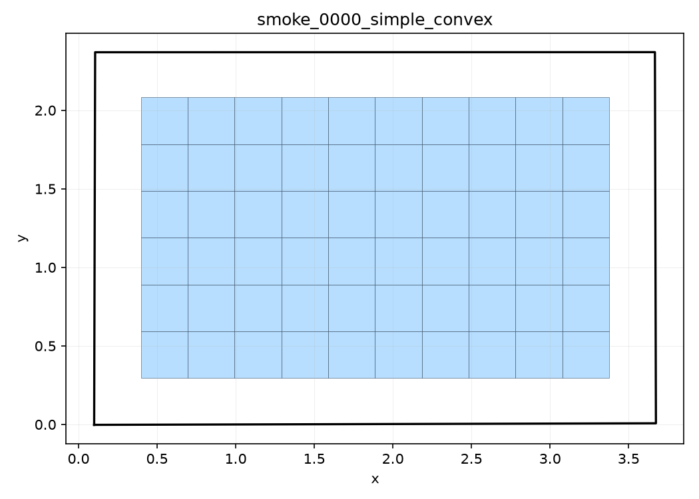
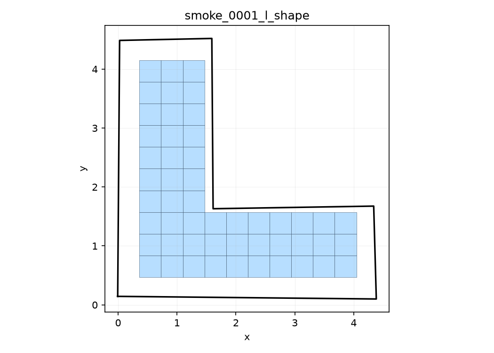
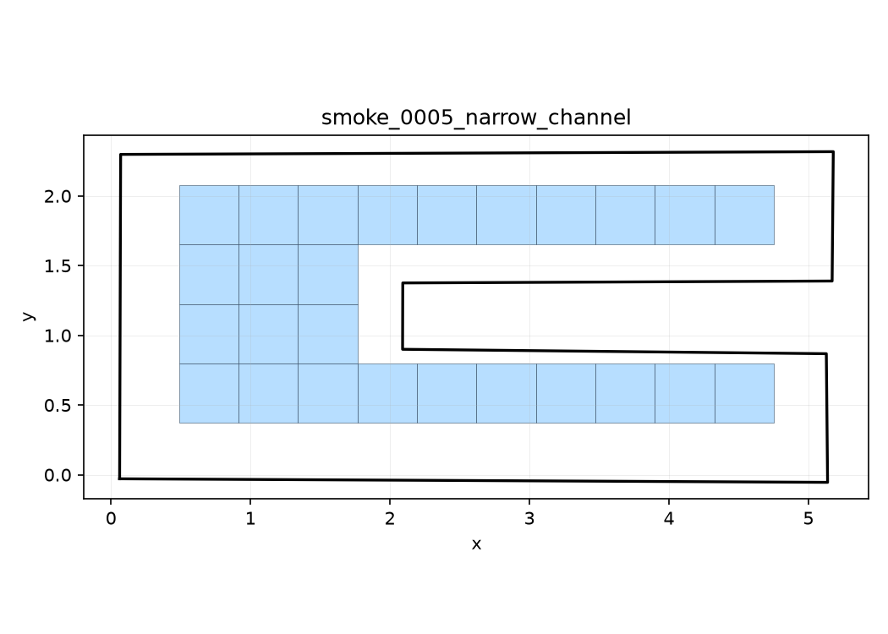

# Demo Report

This demo was generated from the committed smoke dataset:

```bash
python -m freemesh_rl.cli.generate_data --preset smoke --count 30 --out data/smoke --seed 123
python -m freemesh_rl.cli.evaluate_baseline --cases data/smoke/manifest.json --out outputs/baseline_smoke --max-plots 6
python -m freemesh_rl.cli.train_smoke --config configs/local_smoke.yaml --fallback-random
```

## Baseline Summary

```json
{
  "case_count": 30,
  "completion_rate": 0.0,
  "mean_completion_ratio": 0.588441932511162,
  "mean_valid_quad_ratio": 1.0,
  "mean_element_quality": 0.9999999999999999,
  "total_invalid_count": 0,
  "total_runtime_seconds": 0.560763824993046
}
```

## Representative Plots







## RL Smoke Fallback

The local base environment completed a random-policy RL fallback because Stable-Baselines3/Torch were not installed during the first base smoke run.

Summary from `runs/local_smoke/train_smoke.json`:

```json
{
  "status": "completed_random_fallback",
  "episodes": 8,
  "mean_reward": 5.771305725403625,
  "success_rate": 1.0,
  "mean_best_quality": 1.0
}
```

This fallback verifies the Level 2 environment loop, action space, reward path, and reporting path. It is not SAC training and does not claim paper-metric reproduction.
